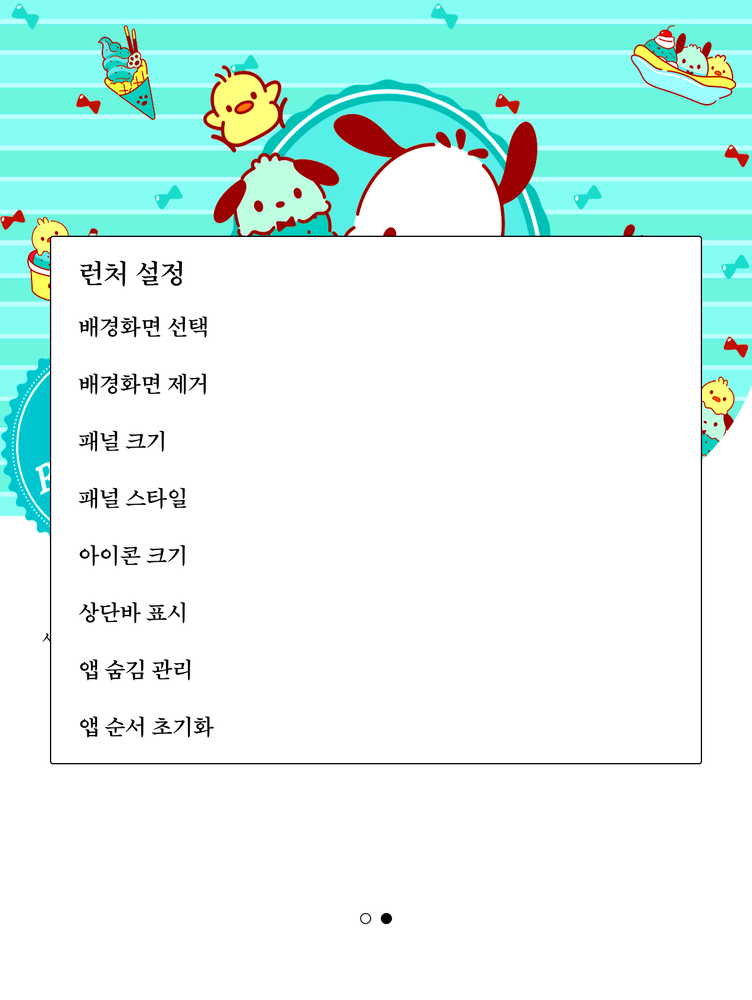
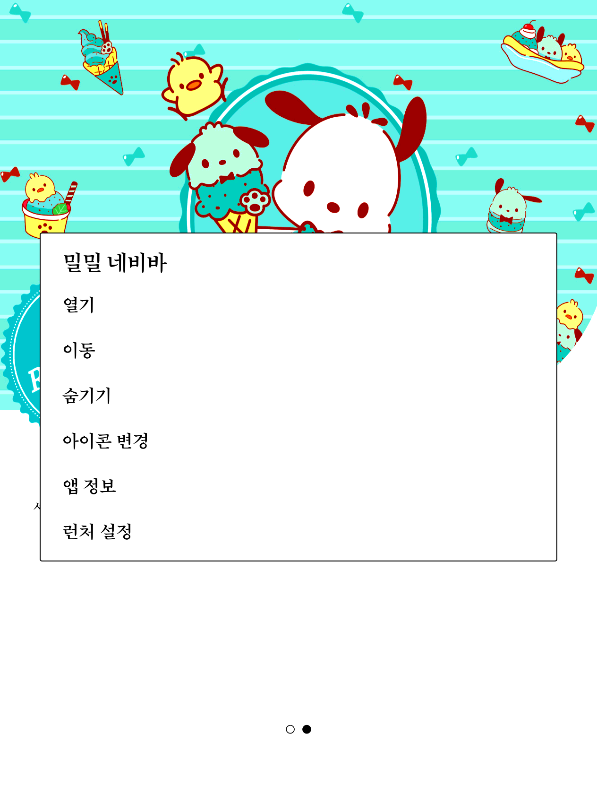

# 밀밀 런처 (Milmil Launcher)

크레마 팔레트(YES24 e-ink 리더) 전용 초경량 개인 홈 런처입니다. e-ink에 맞춰 애니메이션과 백그라운드 작업 없이 즉시 반응하도록 만들었습니다.


## 특징

- **앱 그리드** (4열) : 홈에 표시할 앱 선택과 정렬, 숨기기
- **패널 크기** : 2줄 / 3줄 / 4줄 / 전체 화면
- **배경 스타일** : 투명 / 반투명 / 종이 / 액자
- **아이콘 크기** : 보통 / 크게
- **앱 아이콘 교체** : 원하는 이미지를 앱 아이콘으로 지정
- **물리 페이지키** : 크레마 상하 버튼(`PAGE_UP` / `PAGE_DOWN`)으로 페이지 전환
- 검정 텍스트와 선, 페이지 즉시 교체 (e-ink 최적화)

## 설치

[릴리스](../../releases/latest)에서 `milmil-launcher-0.1.0.apk`를 받아 설치합니다.

```bash
# 크레마는 adb 설치를 기기 베리파이어가 막을 수 있어, 최초 1회만:
adb shell settings put global verifier_verify_adb_installs 0

adb install milmil-launcher-0.1.0.apk
```

설치 후 홈 버튼을 눌러 "밀밀 런처"를 기본 홈으로 지정합니다.

## 사용법

### 런처 설정 (빈 곳 길게 누르기)

홈 화면의 빈 영역을 길게 누르면 런처 설정이 열립니다.



- **배경화면 선택 / 제거** : 홈 배경 이미지를 지정하거나 없앱니다.
- **패널 크기** : 앱 그리드가 차지하는 높이(2줄 / 3줄 / 4줄 / 전체 화면).
- **패널 스타일** : 그리드 뒤 배경 처리(투명 / 반투명 / 종이 / 액자).
- **아이콘 크기** : 보통 / 크게.
- **상단바 표시** : 런처 화면에서 상단바를 숨기거나 표시합니다.
- **앱 숨김 관리 / 앱 순서 초기화** : 숨긴 앱을 되돌리거나 순서를 초기화합니다.

### 앱 관리 (앱 아이콘 길게 누르기)

앱 아이콘을 길게 누르면 관리 메뉴가 열립니다.



- **열기** : 앱 실행.
- **이동** : 홈에서의 순서 변경.
- **숨기기** : 홈에서 감추기(앱 숨김 관리에서 복구).
- **아이콘 변경** : 원하는 이미지를 골라 그 앱의 아이콘으로 지정합니다.
- **앱 정보** : 시스템 앱 정보 화면.
- **런처 설정** : 위 런처 설정으로 바로 이동.

### 페이지 전환

크레마 본체의 상하 물리 버튼(페이지 넘김 키)으로 홈 페이지를 넘길 수 있습니다.

## 설계 원칙

- Java와 플랫폼 View / XML만 사용. AndroidX, Kotlin, Compose, 외부 의존성 0개
- 애니메이션, 위젯, 백그라운드 서비스, 네트워크, 타이머 없음 (idle 작업 0)
- 저장은 SharedPreferences만
- `targetSdk 28`은 의도적 (사이드로드 전용)

## 요구 사항

- 크레마 팔레트 (Android 14 / SDK 34, 1264x1680 @320dpi)
- 루트 불필요

## 빌드 (직접 빌드할 경우)

```bash
./gradlew assembleDebug
adb install app/build/outputs/apk/debug/app-debug.apk
```

## 라이선스

MIT
